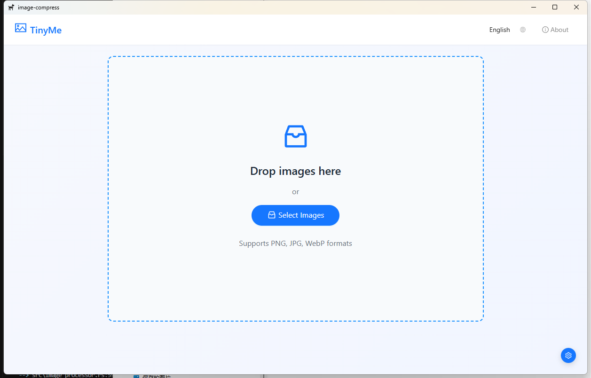
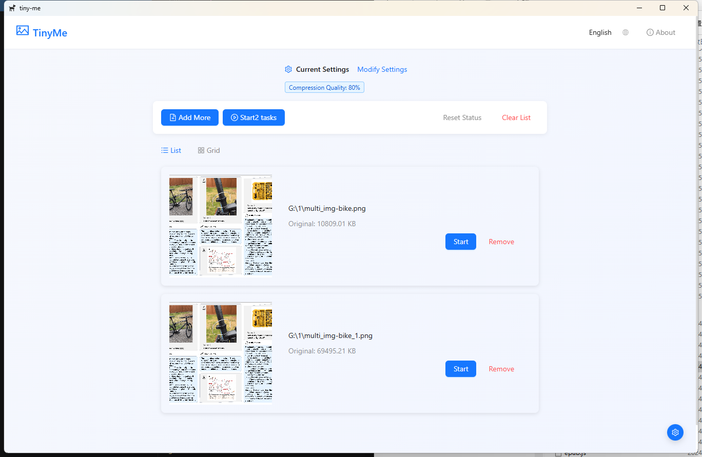
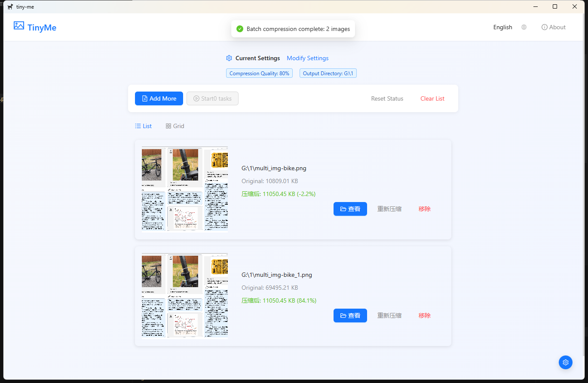
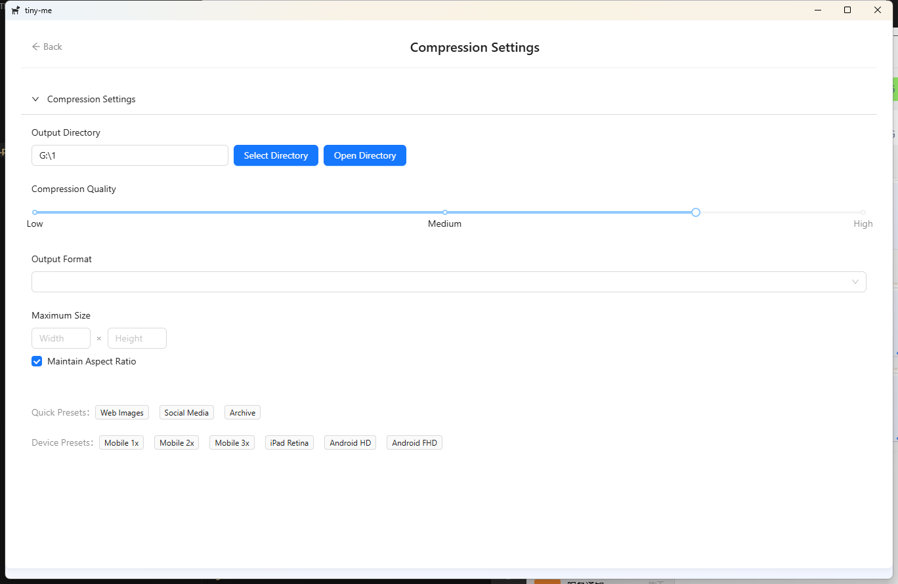

# TinyMe - 轻量级本地图片压缩工具

<div align="center">
  
  <p>
    <em>简单高效的图片压缩，完全本地处理，保护隐私安全</em>
  </p>
</div>

[English](./README_EN.md) | 简体中文

## ✨ 项目简介

TinyMe 是一款简单高效的本地图片压缩工具，专注于提供最佳的图片压缩体验。不同于在线压缩服务，TinyMe 完全在本地处理您的图片，无需网络连接，保护您的数据隐私。

TinyMe 采用 [Tauri](https://tauri.app/) + [React](https://reactjs.org/) + [TypeScript](https://www.typescriptlang.org/) 开发，具有轻量、高效的特点，同时提供美观直观的用户界面。

## 📸 界面预览

<div align="center">
  
  <p>主界面 - 简洁直观的图片上传区域</p>
  
  
  <p>压缩过程 - 实时显示压缩进度和预览</p>
  
  
  <p>结果展示 - 清晰展示压缩效果和文件大小对比</p>
  
  
  <p>设置界面 - 丰富的压缩选项和自定义设置</p>
</div>

## 🚀 特性

- 🖼️ 支持多种图片格式（PNG、JPG、WebP）
- 🧩 智能压缩算法，保持最佳画质
- 📦 批量处理能力
- 🎛️ 多种压缩预设方案
- 🔒 完全本地处理，保护隐私
- 🌐 支持多语言（中文、英文）
- 💻 跨平台支持 (Windows, macOS, Linux)

## 📥 安装

### 下载安装包

访问 [Releases](https://github.com/li2go/tiny-me/releases) 页面下载适合您系统的安装包：

- Windows: `.msi` 或 `.exe` 安装包
- macOS: `.dmg` 安装包
- Linux: `.AppImage` 或 `.deb` 包

### 从源代码构建

如果您希望从源代码构建 TinyMe，请确保您已安装：

1. [Node.js](https://nodejs.org/) (v18+)
2. [Rust](https://www.rust-lang.org/) (最新稳定版)
3. [Tauri CLI](https://tauri.app/v1/guides/getting-started/prerequisites)

然后执行：

```bash
# 克隆仓库
git clone https://github.com/li2go/tiny-me.git
cd tiny-me

# 安装依赖
npm install

# 开发模式运行
npm run tauri dev

# 构建生产版本
npm run tauri build
```

## 🖱️ 使用方法

1. **选择图片**：拖放图片到应用中，或点击"选择图片"按钮
2. **选择压缩设置**：
   - 使用预设：为不同场景选择最佳压缩设置
   - 自定义设置：调整压缩质量、输出格式和最大尺寸
3. **压缩图片**：点击单个图片的"压缩"按钮或批量处理
4. **保存结果**：输出压缩后的图片到您选择的文件夹

## 🌍 国际化

TinyMe 支持多语言：
- 中文
- 英文

系统会自动检测您的系统语言并应用。您也可以在应用右上角手动切换语言。

## 👨‍💻 技术架构

- **前端**：React、TypeScript、Ant Design
- **后端**：Rust、Tauri
- **图像处理**：image-rs 库
- **国际化**：i18next

## 🛠️ 贡献指南

非常欢迎您对 TinyMe 的贡献！无论是功能请求、bug 修复还是文档改进，我们都十分感谢。

1. Fork 此仓库
2. 创建您的特性分支 (`git checkout -b feature/amazing-feature`)
3. 提交您的更改 (`git commit -m 'Add some amazing feature'`)
4. 推送到分支 (`git push origin feature/amazing-feature`)
5. 创建一个 Pull Request

## 📜 许可证

本项目采用 [MIT 许可证](LICENSE)。

## 🙏 致谢

- [Tauri](https://tauri.app/) - 提供了构建轻量级跨平台应用的框架
- [React](https://reactjs.org/) - 用于构建用户界面的 JavaScript 库
- [Ant Design](https://ant.design/) - 企业级 UI 设计语言和 React 组件库
- [image-rs](https://github.com/image-rs/image) - Rust 图像处理库

## 📝 更新日志

查看 [CHANGELOG.md](CHANGELOG.md) 了解各版本变化。

## 📧 联系方式

有任何问题或建议，请通过 [GitHub Issues](https://github.com/li2go/tiny-me/issues) 与我们联系。

---

<div align="center">
  <p>Made with ❤️ by li2go</p>
</div>
